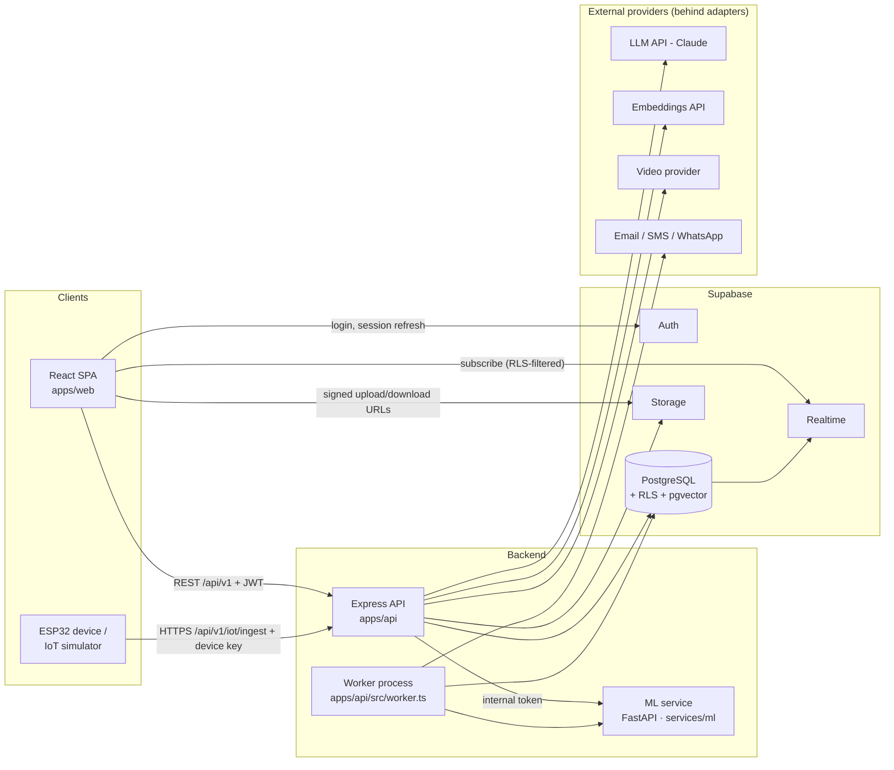
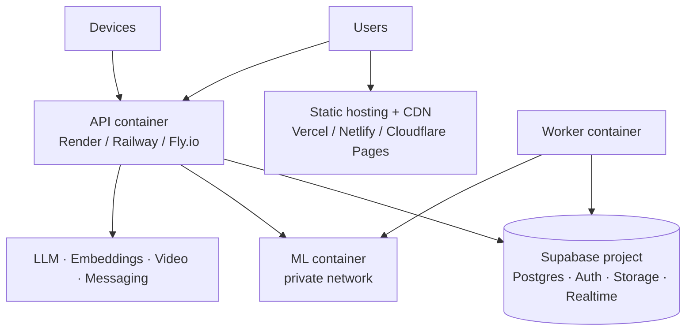

# 02 — System Architecture

## 1. Overview



**Principles**

1. **Backend owns business logic.** The browser talks to Supabase directly only for: auth session
   management, Realtime subscriptions (RLS-protected, read-only), and file transfer via short-lived
   signed URLs issued by the API. All reads/writes of domain data go through the API.
2. **Defense in depth.** Authorization is enforced in the API (role + resource policy) _and_ in
   Postgres via Row Level Security. Request handlers use a **user-scoped** Supabase client
   (the caller's JWT), so RLS applies even if an API check is missed.
3. **Privileged access is isolated.** The service-role client is importable only by system modules
   (worker jobs, IoT ingestion, notification fan-out, admin provisioning) — enforced by an ESLint
   import restriction.
4. **Everything external is an adapter** with a real implementation and an explicit mock selected
   by environment variable (`VIDEO_PROVIDER=mock`, `LLM_PROVIDER=anthropic`, …). Mocks label their
   output so the UI can display a "Simulated"/"Demo" badge.
5. **One shared contract.** Zod schemas and DTO types in `packages/shared` validate input on both
   frontend forms and API routes.

## 2. Frontend architecture (`apps/web`)

| Concern      | Choice                                                                                       |
| ------------ | -------------------------------------------------------------------------------------------- |
| Build        | Vite + React + TypeScript (strict)                                                           |
| Routing      | React Router (data router), lazy-loaded route modules per role area                          |
| Server state | TanStack Query (caching, retries, invalidation); no global store for server data             |
| Client state | React context for auth/session and UI preferences only                                       |
| Forms        | React Hook Form + `@hookform/resolvers/zod` using shared schemas                             |
| Styling      | Tailwind CSS with design tokens (CSS variables) for colour, radius, spacing, typography      |
| Components   | In-house primitives on Radix UI (dialog, dropdown, tabs, tooltip, popover) for accessibility |
| Icons        | lucide-react                                                                                 |
| Charts       | Recharts (vitals, analytics)                                                                 |
| Realtime     | `@supabase/supabase-js` channel subscriptions wrapped in hooks                               |
| i18n         | react-i18next, namespaces per feature                                                        |
| Testing      | Vitest + React Testing Library + MSW; Playwright for E2E                                     |

### Structure

```
apps/web/src/
├─ app/
│  ├─ router.tsx            route tree, lazy role areas
│  ├─ providers.tsx         QueryClient, Auth, I18n, Theme, Toaster
│  ├─ guards/               RequireAuth, RequireRole, RequireOnboarding
│  ├─ navigation.ts         single source for public + dashboard navigation
│  └─ layouts/              PublicLayout, AuthLayout, DashboardLayout (sidebar + topbar + bottom bar)
├─ components/
│  ├─ ui/                   Button, Input, Textarea, Select, Checkbox, RadioGroup, Field, Card, Badge,
│  │                        Alert, Dialog/Modal, ConfirmDialog, Sheet, Dropdown, Tabs, Table,
│  │                        Pagination, Breadcrumb, Toast, Skeleton, Spinner (Radix for dialog/menu/tabs)
│  ├─ layout/               Navbar, Footer, Sidebar, MobileNav (drawer + bottom bar), DashboardTopbar,
│  │                        PageHeader, Container, SkipLink
│  └─ common/               EmptyState, ErrorState, Logo, SafetyNotice
├─ features/
│  ├─ marketing/  dashboard/  system/      (Phase 1–2)
│  ├─ auth/  profile/  doctors/  availability/  appointments/  consultations/
│  ├─ records/  prescriptions/  medications/  pharmacy/  family/
│  ├─ assistant/  medtranslator/  health/  alerts/  notifications/  admin/
│  │   each feature: api.ts (query/mutation hooks) · components/ · pages/ · utils.ts
├─ lib/
│  ├─ api-client.ts         fetch wrapper: base URL, JWT, error envelope → ApiError, request IDs
│  ├─ supabase.ts           anon client (auth + realtime only)
│  ├─ query-keys.ts
│  └─ format.ts             dates in user timezone, units, currency
├─ hooks/                   useAuth, useRole, useRealtime, useMediaQuery
├─ i18n/
└─ styles/                  tokens.css, globals.css
```

### UI/UX conventions

- **States are mandatory:** every data view implements loading (skeleton), empty, error (with retry) and success.
- **Design language:** calm clinical palette (teal/blue primary, slate neutrals), semantic colours for
  status (success, warning, critical) never used as the sole signal (icon + text too); 8 px spacing grid;
  cards and tables for density; subtle 150–200 ms transitions respecting `prefers-reduced-motion`.
- **Responsive shell:** sidebar on desktop, collapsible drawer on tablet/mobile, bottom-priority actions on mobile.
- **Safety UI:** `SafetyNotice` component used consistently in AI, MedTranslator, vitals and alert views.

## 3. Backend architecture (`apps/api`)

| Concern     | Choice                                                                                                              |
| ----------- | ------------------------------------------------------------------------------------------------------------------- |
| Runtime     | Node.js 22+ LTS, Express 5, TypeScript (strict), ESM                                                                |
| Validation  | Zod (shared schemas) via `validate({ body, query, params })` middleware                                             |
| Data access | `@supabase/supabase-js` — per-request user-scoped client; Postgres functions (RPC) for multi-step atomic operations |
| Auth        | Supabase JWT verified locally against the project JWKS (`jose`), profile/role loaded per request                    |
| Security    | helmet, strict CORS allowlist, express-rate-limit, body size limits, request IDs                                    |
| Logging     | pino with PHI redaction paths; request logging with request ID                                                      |
| Errors      | Typed `AppError` hierarchy → single error handler → consistent JSON envelope                                        |
| AI          | Anthropic TypeScript SDK (`@anthropic-ai/sdk`) behind an `LlmClient` interface                                      |
| Jobs        | Separate worker entry point; DB-claimed jobs (`FOR UPDATE SKIP LOCKED`) so multiple instances are safe              |
| Docs        | OpenAPI generated from Zod schemas (`zod-to-openapi`), served at `/api/docs` in non-production                      |
| Tests       | Vitest + Supertest; integration tests against a test Supabase database                                              |

### Layering per module

```
routes.ts      → HTTP wiring: path, middleware (auth, role, validate, rate limit)
controller.ts  → maps HTTP ↔ service; no business logic
service.ts     → business rules, orchestration, notifications, audit events
repository.ts  → Supabase queries/RPC only; returns typed rows
policies.ts    → resource-level authorization (canViewPatient, canManageAppointment …)
*.test.ts      → unit tests (service/policies) + route integration tests
```

### Structure

```
apps/api/src/
├─ server.ts               HTTP server bootstrap, graceful shutdown
├─ worker.ts               background job runner bootstrap
├─ app.ts                  express app composition
├─ config/env.ts           zod-validated environment (fails fast on missing vars)
├─ middleware/             requestId, authenticate, requireRole, validate, rateLimit, errorHandler, notFound
├─ lib/
│  ├─ supabase/user-client.ts    per-request client (RLS enforced)
│  ├─ supabase/admin-client.ts   service role (restricted import)
│  ├─ errors.ts  logger.ts  http.ts (envelope, pagination)  time.ts
├─ integrations/           interface + implementations (+ mock) for:
│  ├─ llm/  embeddings/  video/  ocr/  ml/  email/  sms/  payments/
├─ modules/
│  ├─ me/  patients/  doctors/  specialties/  availability/  appointments/  consultations/
│  ├─ records/  prescriptions/  medications/  pharmacy/  orders/  family/
│  ├─ assistant/  medtranslator/  knowledge/  iot/  health/  alerts/
│  ├─ notifications/  admin/  analytics/  audit/
└─ jobs/
   ├─ generate-medication-doses.ts   detect-missed-doses.ts   appointment-reminders.ts
   ├─ dispatch-notifications.ts      escalate-alerts.ts       score-health-windows.ts
   └─ ingest-knowledge-document.ts   process-document-analysis.ts
```

## 4. Repository / folder structure

```
nexuscare/
├─ apps/
│  ├─ web/                    React SPA
│  └─ api/                    Express API + worker
├─ packages/
│  └─ shared/                 zod schemas, DTO types, enums, permission scopes,
│                             generated database types (src/db/database.types.ts)
├─ services/
│  └─ ml/                     Python FastAPI service
│     ├─ app/                 main.py, routers/, features/, models/, schemas.py, config.py
│     ├─ training/            reproducible training scripts + data README (sources, licences)
│     ├─ artifacts/           versioned model files (gitignored) + model cards (committed)
│     ├─ tests/               pytest
│     └─ pyproject.toml
├─ iot/
│  ├─ simulator/              TypeScript CLI that streams labelled simulated readings
│  └─ firmware/esp32/         PlatformIO/Arduino sketch (later phase)
├─ supabase/
│  ├─ migrations/             timestamped SQL migrations — single source of truth for schema/RLS
│  ├─ seed/                   demo-only seed (every row flagged is_demo = true)
│  ├─ tests/                  pgTAP RLS/permission tests
│  └─ config.toml
├─ e2e/                       Playwright specs
├─ docs/                      this blueprint
├─ .github/workflows/         ci.yml (typecheck, lint, test, build), ml.yml
├─ package.json               npm workspaces + root scripts
├─ tsconfig.base.json  eslint.config.js  .prettierrc  .editorconfig  .gitignore
└─ .env.example (per app)     no real secrets ever committed
```

### Root scripts (planned)

| Script               | Purpose                                      |
| -------------------- | -------------------------------------------- |
| `npm run dev`        | web + api concurrently                       |
| `npm run dev:worker` | worker process                               |
| `npm run typecheck`  | `tsc --noEmit` across workspaces             |
| `npm run lint`       | ESLint (flat config) + Prettier check        |
| `npm test`           | Vitest across workspaces                     |
| `npm run build`      | build shared → api → web                     |
| `npm run db:types`   | regenerate `database.types.ts` from Supabase |
| `npm run sim`        | start IoT simulator                          |

## 5. Configuration

Each app validates its environment at startup (zod) and refuses to start if misconfigured.

| Variable                                                                                 | App     | Notes                               |
| ---------------------------------------------------------------------------------------- | ------- | ----------------------------------- |
| `VITE_API_URL`, `VITE_SUPABASE_URL`, `VITE_SUPABASE_ANON_KEY`                            | web     | Public values only.                 |
| `SUPABASE_URL`, `SUPABASE_ANON_KEY`, `SUPABASE_SERVICE_ROLE_KEY`                         | api     | Service key server-side only.       |
| `CORS_ORIGINS`, `PORT`, `NODE_ENV`, `LOG_LEVEL`                                          | api     |                                     |
| `LLM_PROVIDER`, `ANTHROPIC_API_KEY`, `LLM_MODEL` (default `claude-opus-5-5`)             | api     |                                     |
| `EMBEDDINGS_PROVIDER`, `EMBEDDINGS_API_KEY`, `EMBEDDINGS_MODEL`, `EMBEDDINGS_DIMENSIONS` | api     | Dimension must match DB column.     |
| `VIDEO_PROVIDER`, provider keys                                                          | api     | `mock` allowed in dev.              |
| `ML_SERVICE_URL`, `ML_SERVICE_TOKEN`                                                     | api, ml | Internal shared secret.             |
| `EMAIL_PROVIDER`, `SMS_PROVIDER` (+ keys)                                                | api     | Later phases; `log` adapter in dev. |
| `EMERGENCY_NUMBER_DEFAULT`                                                               | api     | Overridable per region by admin.    |
| `IOT_INGEST_MAX_BATCH`, `IOT_INGEST_RATE_LIMIT`                                          | api     |                                     |

## 6. Deployment architecture



- **Environments:** `local` (dev Supabase project or local Supabase via Docker), `staging`, `production` —
  each with its own Supabase project and secrets.
- **Containers:** API and worker share one Docker image with different start commands; ML has its own image.
- **CI (GitHub Actions):** install → typecheck → lint → unit tests → build → (on main) migrations check
  and deploy. ML workflow runs pytest and model-card validation.
- **Migrations:** applied with the Supabase CLI (`supabase db push`) from CI; never edited after merge.
- **Region:** choose the Supabase/API region closest to the target users to minimise latency and to
  respect data-residency requirements.
- **Backups:** Supabase daily backups; point-in-time recovery on paid tiers for production.
