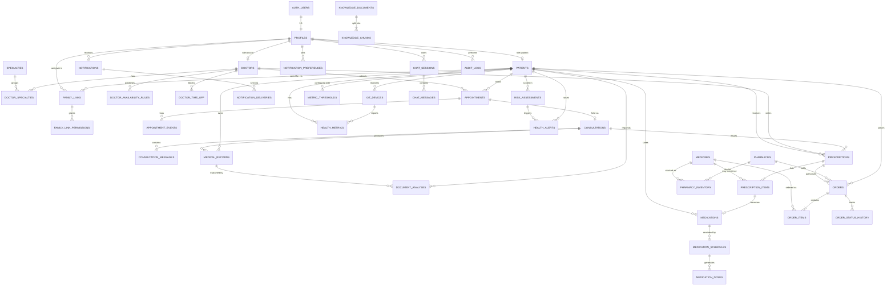

# 03 — Database Design

PostgreSQL on Supabase. SQL migrations in `supabase/migrations/` are the single source of truth;
TypeScript types are generated from the live schema into `packages/shared`.

## 1. Conventions

| Rule          | Detail                                                                                                                                               |
| ------------- | ---------------------------------------------------------------------------------------------------------------------------------------------------- |
| Keys          | `uuid` primary keys (`gen_random_uuid()`); high-volume append tables (`health_metrics`, `audit_logs`) use `bigint generated always as identity`.     |
| Time          | All instants are `timestamptz` stored in UTC. Wall-clock rules (availability, reminder times) use `time` + an IANA `timezone` column.                |
| Naming        | `snake_case`, plural table names, FK columns `<entity>_id`.                                                                                          |
| Audit columns | `created_at`, `updated_at` (trigger-maintained) on mutable tables.                                                                                   |
| Soft delete   | `deleted_at` on user-owned content (records, chat sessions); hard-delete via retention jobs.                                                         |
| Enums         | Postgres enums for stable state machines; `text` + check constraint/shared Zod enum for lists that will grow (notification types).                   |
| Money         | `numeric(12,2)` + `currency char(3)`.                                                                                                                |
| Demo data     | Seeded rows carry `is_demo boolean default false` on tables that can hold demo data (profiles, doctors, pharmacies, medicines, knowledge_documents). |
| Security      | RLS **enabled on every table** in `public`; no table is readable without a policy.                                                                   |

## 2. Design decisions vs. the suggested entity list

| Suggested                        | Decision                                                                | Why                                                                                                                              |
| -------------------------------- | ----------------------------------------------------------------------- | -------------------------------------------------------------------------------------------------------------------------------- |
| `users`                          | **`profiles`** (1:1 with `auth.users`)                                  | Supabase Auth owns credentials in `auth.users`; app data lives in `profiles`.                                                    |
| `patients`, `doctors`            | Kept as role-extension tables keyed by `profile_id`                     | Role-specific columns without nullable sprawl in `profiles`.                                                                     |
| `family_members`                 | **`family_links`** (patient ↔ caregiver relationship)                   | A caregiver is a profile; the _relationship_ (with status and invite) is the entity. One caregiver can support several patients. |
| `family_permissions`             | **`family_link_permissions`** (one row per granted scope)               | Default-deny, auditable, trivially revocable, easy to check in RLS.                                                              |
| `doctor_availability`            | **`doctor_availability_rules`** + **`doctor_time_off`**                 | Recurring weekly rules + exceptions; slots computed, not stored.                                                                 |
| —                                | **`appointment_events`**                                                | Reschedule/cancel history and patient-visible timeline.                                                                          |
| `consultations`                  | Kept, **1:1 with `appointments`**                                       | Clinical session data separated from scheduling.                                                                                 |
| —                                | **`consultation_messages`**                                             | Low-bandwidth async chat within a consultation.                                                                                  |
| `prescriptions`                  | Kept + **`prescription_items`**                                         | A prescription has many lines.                                                                                                   |
| `medications`                    | Kept = the patient's **active medication list**                         | Distinct from catalogue `medicines`; can be prescribed or self-reported.                                                         |
| `medicine_reminders`             | **`medication_schedules`** (rules) + **`medication_doses`** (instances) | Needed for taken/missed tracking and family alerts.                                                                              |
| `medicines`                      | Kept = **pharmacy catalogue**                                           |                                                                                                                                  |
| `pharmacies`                     | Kept + **`pharmacy_inventory`**                                         | Price/stock per pharmacy.                                                                                                        |
| `orders`, `order_items`          | Kept + **`order_status_history`**                                       | Tracking timeline.                                                                                                               |
| `notifications`                  | Kept + **`notification_preferences`** + **`notification_deliveries`**   | Preferences per category; deliveries act as an outbox for external channels.                                                     |
| `health_metrics`                 | Kept (narrow time-series)                                               | One row per reading/metric.                                                                                                      |
| `iot_devices`                    | Kept                                                                    | Hashed per-device API keys.                                                                                                      |
| `health_alerts`                  | Kept + **`metric_thresholds`** + **`risk_assessments`**                 | Rules and ML outputs are first-class and traceable.                                                                              |
| `chat_sessions`, `chat_messages` | Kept                                                                    |                                                                                                                                  |
| `knowledge_documents`            | Kept + **`knowledge_chunks`** (pgvector)                                | Chunk-level embeddings and citations.                                                                                            |
| —                                | **`document_analyses`**                                                 | MedTranslator results.                                                                                                           |
| —                                | **`specialties`**, **`doctor_specialties`**                             | Filterable discovery.                                                                                                            |
| —                                | **`audit_logs`**                                                        | Sensitive-access and admin-action audit.                                                                                         |
| —                                | **`platform_settings`**                                                 | Emergency number, feature flags.                                                                                                 |

## 3. Enums

```sql
app_role                 : patient | doctor | caregiver | admin
account_status           : active | suspended | deactivated
doctor_verification      : pending | verified | rejected | suspended
consultation_mode        : video | audio | in_person
appointment_status       : scheduled | in_progress | completed | cancelled | no_show
consultation_status      : waiting | active | ended
record_type              : lab_report | imaging | prescription_scan | discharge_summary
                           | clinical_note | vaccination | other
record_source            : patient_upload | doctor_upload | consultation | system
prescription_status      : active | completed | cancelled
medication_status        : active | paused | completed | stopped
medication_source        : prescribed | self_reported
dose_status              : pending | taken | skipped | missed
order_status             : pending_review | confirmed | packed | out_for_delivery
                           | delivered | cancelled | rejected
payment_method           : cash_on_delivery | mock_online
payment_status           : unpaid | paid | refunded
family_link_status       : invited | active | declined | revoked
family_scope             : view_profile | view_appointments | manage_appointments | view_records
                           | view_prescriptions | view_medications | receive_medication_alerts
                           | view_health_metrics | receive_emergency_alerts
metric_type              : heart_rate | spo2 | body_temperature | bp_systolic | bp_diastolic
                           | respiratory_rate | blood_glucose
metric_source            : device | simulator | manual
alert_source             : threshold_rule | ml_model | patient_sos | device
alert_severity           : info | warning | critical
alert_status             : open | acknowledged | resolved
risk_level               : low | moderate | high
processing_status        : queued | processing | completed | failed
kb_document_status       : draft | processing | published | archived
chat_role                : user | assistant
```

## 4. Entities by domain

Columns abbreviated to the essentials; every mutable table also has `created_at`/`updated_at`.

### 4.1 Identity

> **Implemented in Phase 3** (`apps/api/migrations/0001_auth_and_profiles.sql`, ADR-020):
> `users` (credentials: citext email, Argon2id `password_hash`, `role`, `status`, lockout fields),
> `profiles` (keyed by `user_id`; no `role` column — role lives on `users`), `patients`, `doctors`
> (`verification_status` default `pending`), `sessions` (hashed token, idle/absolute expiry,
> revocation) and `audit_logs`. Columns listed below that do not exist yet are added in the phases
> that need them.

| Table                  | Key columns                                                                                                                                                                                                                                                                                                                                                    |
| ---------------------- | -------------------------------------------------------------------------------------------------------------------------------------------------------------------------------------------------------------------------------------------------------------------------------------------------------------------------------------------------------------- |
| **profiles**           | `id` PK → `auth.users.id`, `role app_role`, `full_name`, `email`, `phone`, `avatar_path`, `preferred_language`, `timezone`, `status account_status`, `onboarding_completed_at`, `is_demo`                                                                                                                                                                      |
| **patients**           | `profile_id` PK/FK → profiles, `date_of_birth`, `sex`, `blood_group`, `height_cm`, `weight_kg`, `allergies text[]`, `chronic_conditions text[]`, `emergency_contact_name`, `emergency_contact_phone`, address fields, `ai_personal_context_consent boolean default false`                                                                                      |
| **doctors**            | `profile_id` PK/FK → profiles, `registration_number`, `registration_council`, `years_experience`, `bio`, `languages text[]`, `consultation_fee`, `currency`, `consultation_modes consultation_mode[]`, `clinic_name`, `clinic_address`, `verification_status`, `verification_note`, `verified_by` → profiles, `verified_at`, `accepts_new_patients`, `is_demo` |
| **specialties**        | `id`, `name` unique, `slug` unique                                                                                                                                                                                                                                                                                                                             |
| **doctor_specialties** | PK (`doctor_id`, `specialty_id`)                                                                                                                                                                                                                                                                                                                               |
| **platform_settings**  | `key` PK, `value jsonb`, `updated_by`                                                                                                                                                                                                                                                                                                                          |

### 4.2 Family

| Table                       | Key columns / constraints                                                                                                                                                                                                                                                                                                     |
| --------------------------- | ----------------------------------------------------------------------------------------------------------------------------------------------------------------------------------------------------------------------------------------------------------------------------------------------------------------------------- |
| **family_links**            | `id`, `patient_id` → patients, `caregiver_id` → profiles (null while `invited`), `relationship`, `status family_link_status`, `invited_email`, `invite_token_hash`, `invite_expires_at`, `accepted_at`, `revoked_at`, `revoked_by`. Unique partial index (`patient_id`, `caregiver_id`) where status in (`invited`,`active`). |
| **family_link_permissions** | PK (`link_id`, `scope family_scope`), `granted_at`. Written only by the patient (RLS).                                                                                                                                                                                                                                        |

### 4.3 Scheduling

| Table                         | Key columns / constraints                                                                                                                                                                                                                                                                                                                                                    |
| ----------------------------- | ---------------------------------------------------------------------------------------------------------------------------------------------------------------------------------------------------------------------------------------------------------------------------------------------------------------------------------------------------------------------------- |
| **doctor_availability_rules** | `id`, `doctor_id`, `weekday smallint 0–6`, `start_time`, `end_time`, `slot_minutes` (10–120), `modes consultation_mode[]`, `timezone`, `effective_from date`, `effective_until date null`. Check `end_time > start_time`.                                                                                                                                                    |
| **doctor_time_off**           | `id`, `doctor_id`, `starts_at`, `ends_at`, `reason`                                                                                                                                                                                                                                                                                                                          |
| **appointments**              | `id`, `patient_id`, `doctor_id`, `starts_at`, `ends_at`, `mode`, `status`, `reason_for_visit`, `booked_by` → profiles, `cancelled_by`, `cancelled_at`, `cancellation_reason`, `reschedule_count`. **Exclusion constraints** (btree_gist): no overlapping `tstzrange(starts_at, ends_at)` per `doctor_id`, and per `patient_id`, where status in (`scheduled`,`in_progress`). |
| **appointment_events**        | `id`, `appointment_id`, `actor_id`, `event_type` (booked/rescheduled/cancelled/started/completed/no_show), `previous_starts_at`, `new_starts_at`, `note`, `created_at`                                                                                                                                                                                                       |

Slot generation: `rules ∩ effective dates − time_off − active appointments − past/too-soon slots`,
computed in the API (pure, unit-tested function) for a requested window (max 31 days).
Booking runs through the RPC `book_appointment(...)` which re-validates the slot against the rules and
relies on the exclusion constraint as the final guard against double booking.

### 4.4 Consultations

| Table                     | Key columns                                                                                                                                                                                                                                             |
| ------------------------- | ------------------------------------------------------------------------------------------------------------------------------------------------------------------------------------------------------------------------------------------------------- |
| **consultations**         | `id`, `appointment_id` unique, `doctor_id`, `patient_id` (denormalised for RLS), `status`, `video_provider`, `video_room_id`, `started_at`, `ended_at`, `chief_complaint`, `private_notes` (doctor-only), `patient_summary`, `advice`, `follow_up_date` |
| **consultation_messages** | `id`, `consultation_id`, `sender_id`, `body`, `attachment_path`, `created_at`                                                                                                                                                                           |

### 4.5 Records & MedTranslator

| Table                 | Key columns                                                                                                                                                                                                                                                                             |
| --------------------- | --------------------------------------------------------------------------------------------------------------------------------------------------------------------------------------------------------------------------------------------------------------------------------------- |
| **medical_records**   | `id`, `patient_id`, `uploaded_by`, `record_type`, `source`, `title`, `description`, `record_date`, `storage_path`, `mime_type`, `size_bytes`, `sha256`, `consultation_id null`, `hidden_from_doctors boolean default false`, `upload_status` (pending/available/rejected), `deleted_at` |
| **document_analyses** | `id`, `patient_id`, `requested_by`, `medical_record_id null`, `storage_path`, `language`, `reading_level`, `status processing_status`, `extracted_text`, `result jsonb` (validated structured explanation), `model`, `prompt_version`, `error_code`, `completed_at`                     |

### 4.6 Prescriptions & medications

| Table                    | Key columns                                                                                                                                                                                                       |
| ------------------------ | ----------------------------------------------------------------------------------------------------------------------------------------------------------------------------------------------------------------- |
| **prescriptions**        | `id`, `doctor_id`, `patient_id`, `consultation_id null`, `status`, `notes`, `issued_at`, `valid_until`, `cancelled_reason`                                                                                        |
| **prescription_items**   | `id`, `prescription_id`, `medicine_id null` → medicines, `medicine_name` (snapshot), `strength`, `dosage_form`, `dose`, `frequency_per_day`, `timing_notes`, `route`, `duration_days`, `quantity`, `instructions` |
| **medications**          | `id`, `patient_id`, `prescription_item_id null`, `source`, `name`, `strength`, `dose`, `instructions`, `start_date`, `end_date`, `status`, `created_by`                                                           |
| **medication_schedules** | `id`, `medication_id`, `time_of_day time`, `days_of_week smallint[] null` (null = daily), `timezone`, `active`                                                                                                    |
| **medication_doses**     | `id`, `medication_id`, `schedule_id`, `patient_id`, `scheduled_at`, `status`, `recorded_at`, `recorded_by`. Unique (`schedule_id`, `scheduled_at`) → idempotent generation.                                       |

### 4.7 Pharmacy

| Table                    | Key columns                                                                                                                                                                                                                                    |
| ------------------------ | ---------------------------------------------------------------------------------------------------------------------------------------------------------------------------------------------------------------------------------------------- |
| **medicines**            | `id`, `name`, `generic_name`, `manufacturer`, `dosage_form`, `strength`, `pack_size`, `requires_prescription`, `description`, `is_active`, `is_demo`                                                                                           |
| **pharmacies**           | `id`, `name`, `license_number`, `phone`, `email`, address fields, `latitude`, `longitude`, `delivery_radius_km`, `is_active`, `is_demo`                                                                                                        |
| **pharmacy_inventory**   | PK (`pharmacy_id`, `medicine_id`), `price`, `currency`, `stock_quantity` (check ≥ 0)                                                                                                                                                           |
| **orders**               | `id`, `patient_id`, `placed_by`, `pharmacy_id`, `prescription_id null`, `status`, `payment_method`, `payment_status`, `subtotal`, `delivery_fee`, `total`, `currency`, delivery address snapshot, `contact_phone`, `notes`, `rejection_reason` |
| **order_items**          | `id`, `order_id`, `medicine_id`, `prescription_item_id null`, `quantity` (> 0), `unit_price`, `line_total`                                                                                                                                     |
| **order_status_history** | `id`, `order_id`, `status`, `changed_by`, `note`, `created_at`                                                                                                                                                                                 |

Order placement runs in RPC `place_order(...)`: price lookup from inventory (never trusted from the
client), stock decrement with row locks, Rx validation flag, status history row — all in one transaction.

### 4.8 Notifications

| Table                        | Key columns                                                                                                                               |
| ---------------------------- | ----------------------------------------------------------------------------------------------------------------------------------------- |
| **notifications**            | `id`, `recipient_id`, `type`, `category`, `title`, `body`, `data jsonb` (entity refs for deep links), `priority`, `read_at`, `created_at` |
| **notification_preferences** | PK (`profile_id`, `category`), `in_app`, `email`, `sms`, `whatsapp`                                                                       |
| **notification_deliveries**  | `id`, `notification_id`, `channel`, `status` (queued/sent/failed/skipped), `attempts`, `last_error`, `provider_message_id`, `sent_at`     |

### 4.9 IoT, monitoring & alerts

| Table                 | Key columns                                                                                                                                                                                                                                                                          |
| --------------------- | ------------------------------------------------------------------------------------------------------------------------------------------------------------------------------------------------------------------------------------------------------------------------------------ |
| **iot_devices**       | `id`, `patient_id`, `name`, `device_type`, `hardware_id`, `key_prefix`, `key_hash`, `is_simulated`, `status` (active/revoked), `firmware_version`, `last_seen_at`                                                                                                                    |
| **health_metrics**    | `id bigint`, `patient_id`, `device_id null`, `metric_type`, `value numeric`, `unit`, `source metric_source`, `recorded_at`, `received_at`, `quality jsonb`. Index (`patient_id`, `metric_type`, `recorded_at desc`); BRIN on `recorded_at`. Partition by month when volume requires. |
| **metric_thresholds** | `id`, `patient_id null` (null = platform default), `metric_type`, `warning_low`, `warning_high`, `critical_low`, `critical_high`, `set_by`. Unique (`patient_id`, `metric_type`).                                                                                                    |
| **risk_assessments**  | `id`, `patient_id`, `window_start`, `window_end`, `model_name`, `model_version`, `anomaly_score`, `risk_level`, `contributing_factors jsonb`, `is_simulated_input`                                                                                                                   |
| **health_alerts**     | `id`, `patient_id`, `source`, `severity`, `status`, `title`, `message`, `metric_snapshot jsonb`, `risk_assessment_id null`, `triggered_at`, `acknowledged_by`, `acknowledged_at`, `resolved_by`, `resolved_at`, `resolution_note`, `last_notified_at`, `dedupe_key`                  |

### 4.10 AI

| Table                   | Key columns                                                                                                                                                                                           |
| ----------------------- | ----------------------------------------------------------------------------------------------------------------------------------------------------------------------------------------------------- |
| **chat_sessions**       | `id`, `owner_id` → profiles, `title`, `use_personal_context`, `deleted_at`                                                                                                                            |
| **chat_messages**       | `id`, `session_id`, `role chat_role`, `content`, `citations jsonb` (chunk ids, titles, URLs), `safety jsonb` (emergency flag, refusal), `model`, `input_tokens`, `output_tokens`, `created_at`        |
| **knowledge_documents** | `id`, `title`, `publisher`, `source_url`, `licence`, `language`, `topics text[]`, `content_hash`, `storage_path`, `status`, `version`, `reviewed_by`, `reviewed_at`, `is_demo`                        |
| **knowledge_chunks**    | `id`, `document_id`, `chunk_index`, `heading_path`, `content`, `token_count`, `embedding vector(N)`, `embedding_model`, `fts tsvector` (generated). HNSW index on `embedding` (cosine), GIN on `fts`. |

### 4.11 Audit

| Table          | Key columns                                                                                                                                                                                                                                         |
| -------------- | --------------------------------------------------------------------------------------------------------------------------------------------------------------------------------------------------------------------------------------------------- |
| **audit_logs** | `id bigint`, `actor_id`, `actor_role`, `action`, `entity_type`, `entity_id`, `patient_id null`, `request_id`, `metadata jsonb` (no PHI values), `created_at`. Insert-only: no update/delete policies; writes through a `SECURITY DEFINER` function. |

## 5. Entity-relationship diagram



## 6. Row Level Security model

### Helper functions (`SECURITY DEFINER`, `STABLE`, `search_path` pinned)

| Function                                      | Returns true when                                                                                            |
| --------------------------------------------- | ------------------------------------------------------------------------------------------------------------ |
| `app_current_role()`                          | Returns the caller's `app_role` from `profiles` (not named `current_role`, which is a reserved SQL keyword). |
| `is_admin()`                                  | Caller role is `admin` and account active.                                                                   |
| `is_patient_self(p uuid)`                     | `auth.uid() = p`.                                                                                            |
| `doctor_has_care_relationship(p uuid)`        | Caller is a verified doctor with at least one appointment with patient `p` in status other than `cancelled`. |
| `caregiver_has_scope(p uuid, s family_scope)` | Active `family_links` row for (p, caller) with a `family_link_permissions` row for scope `s`.                |

### Policy pattern (example: `medical_records` SELECT)

```sql
using (
  deleted_at is null and (
       patient_id = auth.uid()
    or (doctor_has_care_relationship(patient_id) and not hidden_from_doctors)
    or caregiver_has_scope(patient_id, 'view_records')
  )
)
```

Admins do **not** get blanket read access to clinical content; admin tooling uses aggregate views or
explicitly scoped service operations that are audit-logged.

### Policy summary

| Table group             | Patient (self)                                | Doctor                                | Caregiver                                            | Admin                          |
| ----------------------- | --------------------------------------------- | ------------------------------------- | ---------------------------------------------------- | ------------------------------ |
| profiles                | own row R/W (not `role`/`status`)             | read basic info of related patients   | read basic info of linked patients (`view_profile`)  | R/W status                     |
| doctors (verified)      | read                                          | own R/W                               | read                                                 | R/W                            |
| appointments            | own R; writes via RPC                         | own R/W via RPC                       | `view_appointments` R; `manage_appointments` via RPC | R                              |
| consultations           | own R (no `private_notes` — exposed via view) | own R/W                               | —                                                    | —                              |
| medical_records         | own R/W                                       | R if care relationship and not hidden | `view_records` R                                     | —                              |
| prescriptions / items   | own R                                         | R/W own issued                        | `view_prescriptions` R                               | R (Rx verification for orders) |
| medications / doses     | own R/W                                       | R (care relationship)                 | `view_medications` R                                 | —                              |
| orders                  | own R/W (create via RPC)                      | —                                     | —                                                    | R/W                            |
| health_metrics / alerts | own R; alerts acknowledge                     | R (care relationship)                 | `view_health_metrics` / `receive_emergency_alerts`   | aggregates only                |
| chat / analyses         | own only                                      | own only                              | own only                                             | —                              |
| knowledge_*             | R published                                   | R published                           | R published                                          | R/W                            |
| notifications           | own R, update `read_at`                       | same                                  | same                                                 | same                           |
| audit_logs              | —                                             | —                                     | —                                                    | R                              |

`private_notes` is protected by exposing consultations to patients through a view
(`patient_consultations_v`, `security_invoker`) that omits the column, plus a column-level
`REVOKE SELECT` for the `authenticated` role on that column.

## 7. Key indexes

- `appointments (doctor_id, starts_at)`, `appointments (patient_id, starts_at desc)`, GiST exclusion indexes.
- `medication_doses (patient_id, scheduled_at)`, partial `where status = 'pending'`.
- `notifications (recipient_id, created_at desc)`, partial `where read_at is null`.
- `health_metrics (patient_id, metric_type, recorded_at desc)`.
- `health_alerts (patient_id, status, triggered_at desc)`.
- `family_links (caregiver_id) where status = 'active'`, `family_links (patient_id)`.
- `knowledge_chunks` HNSW (`vector_cosine_ops`) + GIN (`fts`).
- `doctors (verification_status)`, GIN on `languages`, trigram index on `profiles.full_name` for search.

## 8. Retention (initial policy, configurable)

| Data                           | Retention                                                              |
| ------------------------------ | ---------------------------------------------------------------------- |
| Raw `health_metrics`           | 180 days; hourly rollups (later table) kept long-term                  |
| `notifications`                | 180 days after read                                                    |
| `chat_messages`                | Until the user deletes the session (soft delete → purge after 30 days) |
| `audit_logs`                   | ≥ 1 year (jurisdiction dependent)                                      |
| Medical records, prescriptions | Until account deletion request processed under applicable law          |
