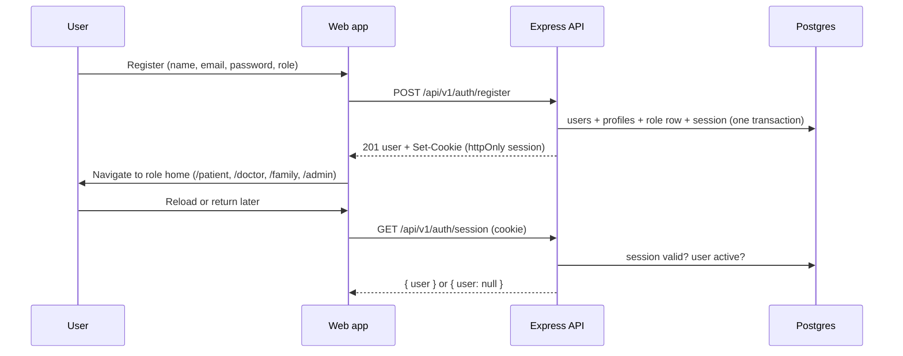
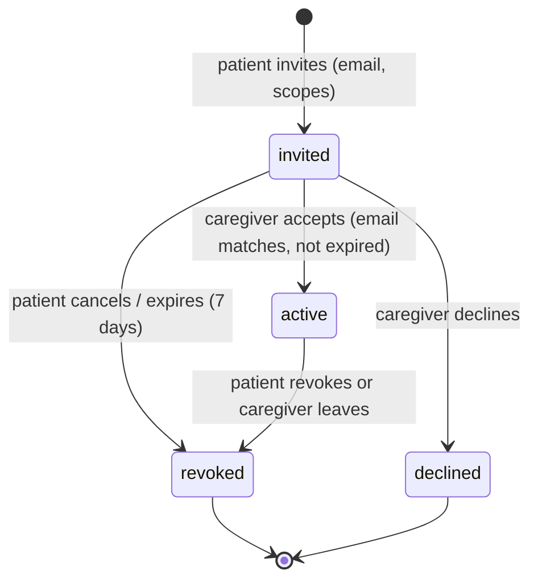

# 05 — Authentication & Authorization

## 1. Authentication (built-in, Phase 3 — see ADR-020)

Authentication is implemented by the Express API on PostgreSQL. The original Supabase Auth design
was replaced in Phase 3 because no Supabase project or Docker was available (ADR-020).

| Aspect             | Implementation                                                                                                                                                                                          |
| ------------------ | ------------------------------------------------------------------------------------------------------------------------------------------------------------------------------------------------------- |
| Methods            | Email + password. Email verification, password reset and phone OTP are planned (they need an email/SMS provider).                                                                                       |
| Password storage   | Argon2id with the OWASP baseline (19 MiB, t=2, p=1) and a unique salt per hash. Policy: 10–128 characters including a letter and a digit (shared Zod schema).                                           |
| Session            | Random 256-bit token in an httpOnly, `SameSite=Lax` cookie (`__Host-nc_session`, Secure, in production). Only its SHA-256 hash is stored in `sessions`.                                                 |
| Session lifetime   | Sliding idle timeout (default 12 h) plus an absolute lifetime (default 7 days). Logout revokes the session server-side; login rotates it.                                                               |
| Suspension         | Sessions of non-active users stop working immediately; login with a correct password returns `ACCOUNT_SUSPENDED`.                                                                                       |
| Brute force        | Per-IP limit on login/register (20 per 15 min) and per-account lockout (10 failures → 15 min). Unknown email, wrong password and locked account all return `INVALID_CREDENTIALS` with equalised timing. |
| CSRF               | `SameSite=Lax` cookie plus an origin check on every state-changing request (`requireTrustedOrigin`).                                                                                                    |
| Profile creation   | Registration creates `users` + `profiles` + `patients`/`doctors` rows in one transaction. Sign-up roles: `patient`, `caregiver`, `doctor` only.                                                         |
| Admin provisioning | `npm run admin:create -- --email … --name …` (CLI only, never over HTTP).                                                                                                                               |
| Audit              | `auth.registered`, `auth.login_succeeded`, `auth.login_failed` (with reason), `auth.login_blocked`, `auth.logged_out`, `auth.admin_provisioned`.                                                        |
| MFA                | Planned (TOTP); required for admins before production use.                                                                                                                                              |

### Flows

### Role areas (frontend)

| Role      | Home     | Guard                                                    |
| --------- | -------- | -------------------------------------------------------- |
| patient   | /patient | RequireAuth → RequireRole(patient)                       |
| doctor    | /doctor  | RequireAuth → RequireRole(doctor)                        |
| caregiver | /family  | RequireAuth → RequireRole(caregiver) — shown as “Family” |
| admin     | /admin   | RequireAuth → RequireRole(admin)                         |

`/dashboard` redirects to the role home. A wrong role sees an “Access denied” page; signed-out
visitors go to `/login?redirectTo=…` (honoured only inside the user’s own area). These guards are UX
only — the API enforces `requireAuth` / `requireRole` on every protected route.

**Doctor:** after onboarding the doctor row has `verification_status = pending`; the doctor area shows a
pending state and only `/doctors/me` endpoints work until an admin verifies.

**Caregiver via invite:** `/invite/:token` → sign up or log in as caregiver → `POST /family/invitations/:token/accept`;
the authenticated email must match the invited email (prevents forwarded-link takeover).

## 2. Authorization layers

1. **Route guard (API):** `authenticate` → `requireActiveAccount` → `requireRole('doctor', ...)` →
   `requireOnboarding` → for doctors on clinical routes `requireVerifiedDoctor`.
2. **Resource policy (API):** `policies.ts` per module answers questions like
   `canViewPatientData(actor, patientId, 'view_records')`. Returns `404` when the existence of the
   resource should not be disclosed.
3. **Row Level Security (Postgres):** planned for clinical tables. With built-in auth (ADR-020) the
   API will connect as a least-privilege role and set the caller's identity per transaction
   (`set local app.user_id`), which the SQL policies (see 03 §6) read instead of Supabase's
   `auth.uid()`.
4. **Frontend guards:** `RequireAuth`, `RequireRole`, `RequireOnboarding` — UX only, never a security boundary.

## 3. Permission matrix

| Capability                    | Patient                       | Doctor                             | Caregiver                   | Admin                  |
| ----------------------------- | ----------------------------- | ---------------------------------- | --------------------------- | ---------------------- |
| Search/view verified doctors  | ✓                             | ✓                                  | ✓                           | ✓                      |
| Manage own profile            | ✓                             | ✓                                  | ✓                           | ✓                      |
| Book / reschedule / cancel    | own                           | cancel own appointments            | if `manage_appointments`    | —                      |
| Manage availability           | —                             | own                                | —                           | —                      |
| Join consultation             | own                           | own                                | —                           | —                      |
| Write consultation notes      | —                             | own consultations                  | —                           | —                      |
| Upload records                | own                           | for patients in care               | —                           | —                      |
| View records                  | own                           | care relationship, not hidden      | `view_records`              | —                      |
| Issue prescriptions           | —                             | verified, own consultations        | —                           | —                      |
| View prescriptions            | own                           | issued by self / care relationship | `view_prescriptions`        | for order verification |
| Medications & reminders       | own (R/W)                     | care relationship (R)              | `view_medications` (R)      | —                      |
| Missed-dose alerts            | own                           | —                                  | `receive_medication_alerts` | —                      |
| Place orders                  | own                           | —                                  | —                           | —                      |
| Manage orders/catalogue       | —                             | —                                  | —                           | ✓                      |
| Register IoT devices          | own                           | —                                  | —                           | —                      |
| View vitals & risk            | own                           | care relationship                  | `view_health_metrics`       | aggregates             |
| Emergency alerts              | own + SOS                     | care relationship                  | `receive_emergency_alerts`  | aggregates             |
| Set personal thresholds       | read                          | care relationship                  | —                           | platform defaults      |
| AI assistant                  | ✓ (+ personal context opt-in) | ✓ (general)                        | ✓ (general)                 | —                      |
| MedTranslator                 | own documents                 | —                                  | —                           | —                      |
| Invite/manage caregivers      | own                           | —                                  | accept/leave                | —                      |
| Verify doctors, suspend users | —                             | —                                  | —                           | ✓                      |
| Manage knowledge base         | —                             | —                                  | —                           | ✓                      |
| Analytics / audit logs        | —                             | —                                  | —                           | ✓ (aggregates / audit) |

## 4. Family consent model

- **Patient-initiated only** in v1 — caregivers cannot request access to someone, removing a
  stalking/abuse vector.
- **Default deny:** an active link with zero scopes grants nothing except seeing the link itself.
- **Scope changes are immediate** (RLS reads current rows; no cached grants).
- **Every caregiver read** of clinical data is written to `audit_logs` with `patient_id`, enabling the
  later "who viewed my data" view.
- `manage_appointments` implies nothing else; each read scope is independent.

## 5. Doctor access model

- A doctor can access a patient's data only with a **care relationship**: at least one non-cancelled
  appointment between them (past or upcoming).
- Records flagged `hidden_from_doctors` are never visible to doctors.
- Doctors see `private_notes` only for consultations they conducted.
- Planned extension: patient-controlled per-doctor access expiry (e.g. 90 days after last appointment).

## 6. Admin model

- Admins manage platform entities and see **aggregates**; they do not browse clinical content.
- Exceptions (Rx verification for an order) are narrow endpoints that return only the necessary
  prescription lines and are audit-logged.
- All admin mutations are audit-logged.
