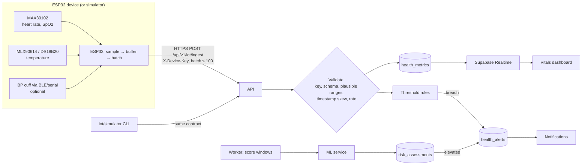
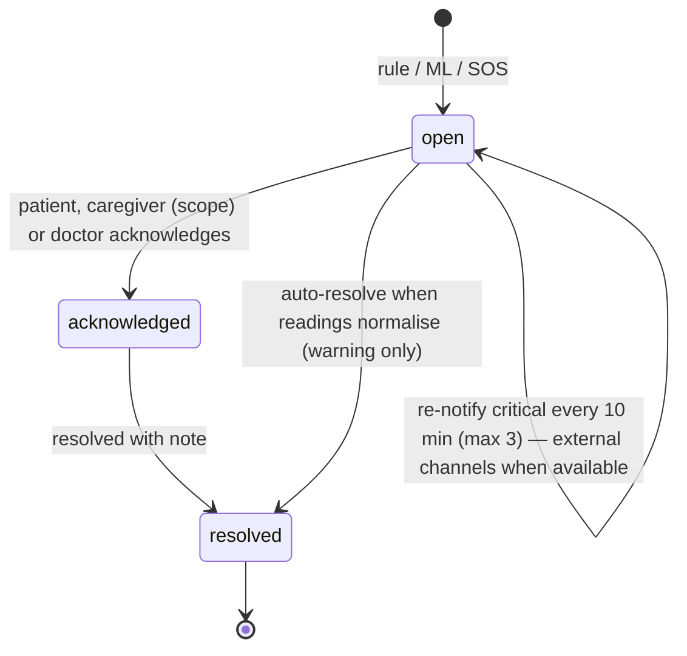

# 07 — IoT Health Monitoring & ML Risk Indication

> **Language rule:** this module performs _health monitoring_, _physiological anomaly detection_ and
> _risk indication/estimation_. It does **not** diagnose heart attacks or any condition. Every alert
> tells the user to contact a clinician or, if they feel unwell, emergency services.

## 1. IoT architecture



### Device provisioning

1. Patient registers a device in **Health → Devices** → API creates `iot_devices` row and returns
   `deviceId` + secret key **once** (stored as a hash; prefix kept for identification).
2. Credentials entered on the device via a captive configuration portal (e.g. WiFiManager) or a
   serial setup command; stored in ESP32 NVS.
3. Patient can rotate or revoke keys at any time; revoked keys fail immediately.

### Ingest contract

```json
POST /api/v1/iot/ingest
X-Device-Key: nc_dev_xxxxxxxx...
Idempotency-Key: <device batch id>
{
  "deviceId": "uuid",
  "firmwareVersion": "0.1.0",
  "readings": [
    { "metric": "heart_rate", "value": 78, "unit": "bpm", "recordedAt": "2026-10-03T10:15:02Z" },
    { "metric": "spo2", "value": 97, "unit": "%", "recordedAt": "2026-10-03T10:15:02Z" }
  ]
}
```

| Validation     | Rule                                                                                                                                |
| -------------- | ----------------------------------------------------------------------------------------------------------------------------------- |
| Authentication | Constant-time hash comparison of device key; device must be `active` and belong to a patient.                                       |
| Schema         | Zod; ≤ 100 readings; known metric/unit pairs.                                                                                       |
| Plausibility   | Physiologically possible ranges only (e.g. HR 20–250 bpm, SpO2 50–100 %, temp 30–44 °C); outside → rejected + counted, not alerted. |
| Time           | `recordedAt` within −24 h / +5 min of server time.                                                                                  |
| Rate limiting  | Per device key (e.g. 120 requests/min) and per IP.                                                                                  |
| Source         | `simulator` when `is_simulated`, else `device`. UI shows a **Simulated data** badge.                                                |

Ingestion uses the service-role client inside the `iot` module only (device requests carry no user JWT).

### Realtime

The dashboard subscribes to `health_metrics` inserts filtered by `patient_id` (RLS applies). Charts
throttle redraws to ~1/s. If volume grows, switch to Supabase Broadcast with server-side downsampling.

### Simulator (`iot/simulator`)

- TypeScript CLI: `npm run sim -- --device <id> --key <key> --scenario normal --interval 2s`.
- Scenarios: `normal`, `exercise`, `tachycardia_episode`, `low_spo2`, `fever`, `sensor_dropout`, `noisy_signal`.
- Uses the real ingest API — exercises the same validation, storage, rules and alerts as hardware.
- Devices created for it are `is_simulated = true`; all derived alerts/assessments carry that flag.

### Firmware (later phase)

`iot/firmware/esp32` (PlatformIO): sensor drivers, signal quality checks, 1–5 s sampling, local ring
buffer for offline periods, batched HTTPS with TLS certificate validation, exponential backoff.

## 2. Threshold rules (deterministic, immediate)

- Platform defaults in `metric_thresholds` (`patient_id IS NULL`); doctors may set per-patient overrides.
- Evaluated synchronously on ingest using a short window (e.g. median of the last 3 readings) to avoid
  single-sample noise.
- Alert de-duplication via `dedupe_key` (patient + metric + severity + 15-minute bucket).
- Defaults are conservative, documented, and labelled as non-clinical configuration.

## 3. ML service (`services/ml`)

| Item       | Choice                                                                                        |
| ---------- | --------------------------------------------------------------------------------------------- |
| Stack      | Python 3.12+, FastAPI, Pydantic, pandas, NumPy, scikit-learn, joblib                          |
| Deployment | Separate container on a private network; `X-Internal-Token` auth; no direct internet exposure |
| Invocation | Worker job `score-health-windows` every 5 min for patients with recent data (and on demand)   |
| Versioning | `artifacts/<model>/<version>/model.joblib` + `model_card.md` (data, metrics, limitations)     |

### Model A — Physiological anomaly detection

- **Input:** a time window (e.g. 15 min) of HR, SpO2, temperature (BP when available).
- **Features:** mean, std, min, max, slope, % time outside personal baseline band, missingness, signal quality.
- **Method:** per-patient baseline (rolling median/IQR from the patient's own history) + Isolation Forest
  trained on normal-range windows; cold-start patients use population-level parameters.
- **Output:** `anomalyScore` (0–1), `isAnomalous`, top contributing features (z-score vs baseline).

### Model B — Cardiovascular risk indication (educational)

- **Input:** profile and recent vitals (age, sex, resting HR, BP, BMI, reported conditions).
- **Method:** logistic regression / gradient-boosted trees trained on a public, licence-compatible
  research dataset (source and licence documented in `training/README.md`); calibrated probabilities
  bucketed into `low | moderate | high`.
- **Output:** risk level, score, contributing factors (coefficients / permutation importance), and a
  mandatory disclaimer. Presented as "risk indication — not a diagnosis".

### Combining signals into alerts

| Condition                                                      | Alert                                                        |
| -------------------------------------------------------------- | ------------------------------------------------------------ |
| Critical threshold breach                                      | `critical`, source `threshold_rule`                          |
| Warning threshold breach                                       | `warning`, source `threshold_rule`                           |
| Anomaly score high **and** a warning breach in the same window | `warning` (escalates to `critical` on persistence)           |
| Risk level becomes `high`                                      | `info/warning` advising the patient to discuss with a doctor |
| SOS                                                            | `critical`, source `patient_sos`                             |

### Honest evaluation

- Report precision/recall/ROC-AUC on held-out data, and calibration curves, in the model card.
- State limitations explicitly: small/non-representative datasets, consumer-grade sensors, motion artefacts.
- Simulator data is never used to claim model performance.

## 4. Alert lifecycle & escalation



Recipients: patient always; caregivers with `receive_emergency_alerts`; doctors see alerts for patients
in their care on their dashboard. Every alert view shows the configured emergency number.
