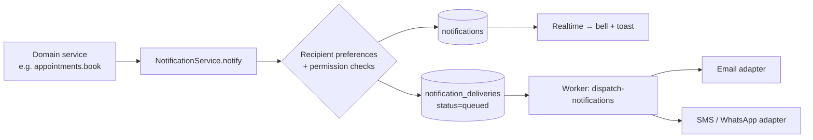
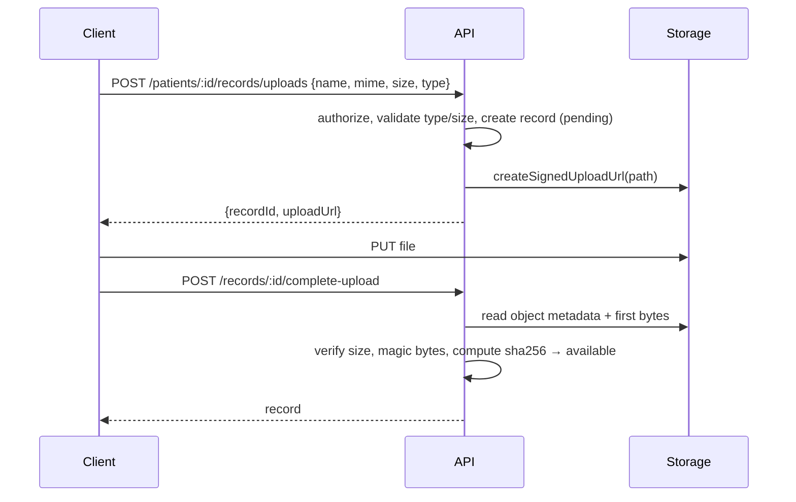

# 08 — Notifications & File Storage

## 1. Notification architecture

- **In-app first:** a `notifications` row is the source of truth; Realtime pushes it to the client.
- **Outbox pattern:** external deliveries are rows processed by the worker with retries and backoff,
  so a provider outage never breaks the domain action.
- **Adapters:** `email` (e.g. Resend/SES), `sms`/`whatsapp` (e.g. Twilio or a regional provider);
  in development a `log` adapter records what _would_ be sent.
- **Privacy:** external messages contain no clinical details — "You have a new update in Nexus Care"
  plus a link. Emergency alerts may include the patient's name and "needs attention", nothing more.
- **Recipients are permission-checked** at send time (e.g. caregiver scopes) — a revoked scope stops
  future notifications immediately.

### Notification catalogue (initial)

| Category     | Types                                                                                                                              | Recipients                                                                       |
| ------------ | ---------------------------------------------------------------------------------------------------------------------------------- | -------------------------------------------------------------------------------- |
| account      | `doctor_verified`, `doctor_rejected`, `account_suspended`                                                                          | user                                                                             |
| appointments | `appointment_booked`, `appointment_rescheduled`, `appointment_cancelled`, `appointment_reminder` (24 h, 1 h), `consultation_ready` | patient, doctor, caregivers with `view_appointments`                             |
| clinical     | `prescription_issued`, `consultation_summary_ready`, `record_shared`                                                               | patient                                                                          |
| medication   | `dose_due`, `dose_missed`                                                                                                          | patient; caregivers with `receive_medication_alerts` (missed only)               |
| pharmacy     | `order_placed`, `order_status_changed`, `order_rejected`                                                                           | patient                                                                          |
| family       | `family_invitation`, `family_invitation_accepted`, `family_permissions_changed`, `family_link_revoked`                             | patient / caregiver                                                              |
| health       | `health_alert_warning`, `health_alert_critical`, `sos_triggered`, `risk_indication_changed`                                        | patient; caregivers with `receive_emergency_alerts`; doctors in care (dashboard) |
| ai           | `document_analysis_ready`                                                                                                          | patient                                                                          |

## 2. File & storage architecture (Supabase Storage)

| Bucket              | Access      | Path pattern                                 | Contents                                                  |
| ------------------- | ----------- | -------------------------------------------- | --------------------------------------------------------- |
| `medical-records`   | private     | `{patientId}/{recordId}/{sanitisedFileName}` | Patient/doctor uploaded records, consultation attachments |
| `document-analyses` | private     | `{patientId}/{analysisId}/...`               | MedTranslator uploads not saved as records                |
| `prescriptions`     | private     | `{patientId}/{prescriptionId}.pdf`           | Generated prescription PDFs (later)                       |
| `knowledge-base`    | private     | `{documentId}/{version}/...`                 | Admin-curated sources                                     |
| `avatars`           | public read | `{profileId}/avatar.webp`                    | Profile photos (re-encoded, metadata stripped)            |

### Upload flow

| Rule             | Value                                                                                |
| ---------------- | ------------------------------------------------------------------------------------ |
| Allowed types    | PDF, JPEG, PNG, WebP (HEIC conversion later); verified by magic bytes, not extension |
| Max size         | 20 MB per file (configurable)                                                        |
| Downloads        | API authorizes, logs to `audit_logs`, returns a 60-second signed URL                 |
| Storage policies | Direct client access to private buckets denied; only signed URLs work                |
| Deletion         | Soft delete in DB; object purge by retention job                                     |
| Malware scanning | Later phase (ClamAV sidecar) before status becomes `available`                       |
| Pending cleanup  | Records stuck in `pending` > 24 h and their objects are removed by a job             |
