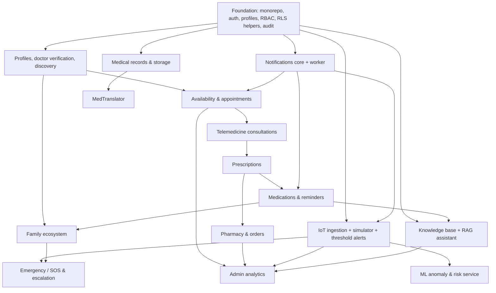

# 11 — Roadmap, Dependencies & Risks

## 1. Feature dependency map

Key dependency notes:

- **Family schema and RLS helpers come early (Phase 2)** even though the family UI arrives in Phase 8,
  so every clinical table's RLS policy includes the caregiver clause from day one — no policy rewrites later.
- **Notifications core precedes appointments** so every later feature emits real notifications.
- **Prescriptions require consultations;** medications require prescriptions (self-reported medications
  can be added without them).
- **ML requires IoT data** (real or simulated) flowing through the real ingest path.

## 2. Implementation order (phase dependency map)

| Phase | Name                                   | Delivers                                                                                                                                                                                                                                                                                                  | Depends on              |
| ----- | -------------------------------------- | --------------------------------------------------------------------------------------------------------------------------------------------------------------------------------------------------------------------------------------------------------------------------------------------------------- | ----------------------- |
| 1     | Foundation & authentication            | Monorepo, tooling, CI, shared package, API skeleton (config, errors, logging, auth middleware), web shell + design system, Supabase migration 001 (enums, profiles, role-extension tables, audit_logs, triggers, custom access-token hook), sign-up/login/reset/verify, role routing, onboarding skeleton | —                       |
| 2     | Profiles, doctors & discovery          | Patient medical profile, doctor application, admin verification queue, user suspension, specialties, public doctor search/profile; **family tables + RLS helper functions (schema only)**                                                                                                                 | 1                       |
| 3     | Notifications core                     | notifications/preferences/deliveries tables, NotificationService, realtime bell + centre, worker process with job claiming, `log` email adapter                                                                                                                                                           | 1                       |
| 4     | Availability & appointments            | Availability rules/time-off, slot engine, `book_appointment` RPC with exclusion constraints, reschedule/cancel/no-show, agendas, reminders job                                                                                                                                                            | 2, 3                    |
| 5     | Telemedicine consultations             | Video adapter (real provider + labelled mock), join window, audio-only mode, consultation chat, notes & patient summary                                                                                                                                                                                   | 4                       |
| 6     | Medical records                        | Storage buckets/policies, signed upload/download, record management, hide-from-doctors, doctor uploads, patient chart records tab                                                                                                                                                                         | 2 (4 for doctor access) |
| 7     | Prescriptions, medications & reminders | Prescriptions from consultations, medication list, schedules, dose generation, missed-dose detection, adherence                                                                                                                                                                                           | 5, 3                    |
| 8     | Family / caregiver ecosystem           | Invitations, acceptance, scopes UI, caregiver dashboard, permitted views, medication alerts to caregivers                                                                                                                                                                                                 | 2, 7                    |
| 9     | Pharmacy & orders                      | Catalogue, pharmacies, inventory, cart/quote, `place_order` RPC, Rx verification, order tracking, admin order processing                                                                                                                                                                                  | 7                       |
| 10    | MedTranslator                          | LLM gateway, structured explanation pipeline, analysis UI, safety checks, eval subset                                                                                                                                                                                                                     | 6                       |
| 11    | RAG health assistant                   | pgvector, KB admin + ingestion, embeddings adapter, hybrid retrieval, SSE chat, citations, safety triage, personal-context opt-in, eval suite                                                                                                                                                             | 10 (gateway), 7         |
| 12    | IoT monitoring                         | Devices + keys, ingest endpoint, simulator, realtime vitals dashboard, thresholds, threshold alerts                                                                                                                                                                                                       | 3                       |
| 13    | ML risk indication                     | FastAPI service, anomaly model, risk model, model cards, scoring job, risk UI, ML-informed alerts                                                                                                                                                                                                         | 12                      |
| 14    | Emergency & escalation                 | SOS, alert escalation/re-notify, caregiver emergency flow, emergency number settings, external email/SMS adapters                                                                                                                                                                                         | 8, 12                   |
| 15    | Admin & analytics                      | Admin overview KPIs, analytics charts, audit-log viewer, settings, knowledge/pharmacy admin polish                                                                                                                                                                                                        | all feature phases      |
| 16    | Hardening & deployment                 | Security review, accessibility audit, performance, E2E suite, Docker images, staging/prod deployment, runbooks                                                                                                                                                                                            | all                     |

Each phase ends with the quality gate in [10-testing-strategy.md](10-testing-strategy.md) and a
completion report, then **stops** for the next phase prompt.

## 3. Risks and mitigations

| #   | Risk                                            | Impact                  | Mitigation                                                                                                                                    |
| --- | ----------------------------------------------- | ----------------------- | --------------------------------------------------------------------------------------------------------------------------------------------- |
| R1  | AI output perceived as medical advice/diagnosis | Patient harm, liability | Strict system prompt, safety triage, refusal tests, persistent disclaimers, no state-changing tools, eval gate before release                 |
| R2  | Fabricated citations/sources                    | Misinformation          | Citations only from retrieved chunks (native citation locations mapped to chunk IDs); curated KB with licence metadata; "not found" behaviour |
| R3  | PHI exposure through access-control bugs        | Privacy breach          | API policies + RLS defense in depth; pgTAP tests for every policy; forbidden-path tests per endpoint; audit logs                              |
| R4  | Family members over-accessing data              | Privacy/abuse           | Patient-initiated, default-deny, per-scope, instantly revocable links; email-matched invites; audit                                           |
| R5  | Double booking / race conditions                | Broken trust            | Postgres exclusion constraints + RPC transactions + idempotency keys                                                                          |
| R6  | Timezone/DST errors in schedules and reminders  | Missed care             | UTC storage, IANA timezone on rules, pure slot/dose functions with DST unit tests                                                             |
| R7  | IoT/ML risk indications mistaken for diagnosis  | Harm, false reassurance | Language rules, model cards with limitations, "simulated" labels, always recommend clinician/emergency services                               |
| R8  | External provider unavailable (LLM, video, SMS) | Feature outage          | Adapters with timeouts/retries, outbox for messaging, clearly labelled mocks for dev, graceful degraded UI                                    |
| R9  | Scope creep — 19 modules                        | Unfinished platform     | Strict phase gating; each phase shippable; no cross-phase partial features                                                                    |
| R10 | No Docker locally → weak DB testing             | RLS regressions         | Install Docker for local Supabase, or dedicated test project; RLS tests mandatory in CI                                                       |
| R11 | Supabase lock-in                                | Migration cost          | Business logic in API; standard SQL migrations; storage/auth accessed through thin wrappers                                                   |
| R12 | LLM cost/latency                                | Budget overrun, slow UX | Effort tuning per route, prompt caching, per-user quotas, token logging, streaming UX                                                         |
| R13 | Low bandwidth in rural areas                    | Unusable consultations  | Audio-only mode, async chat, code splitting, small bundles, later PWA/offline caching and SMS notifications                                   |
| R14 | Regulatory gaps before real deployment          | Legal exposure          | Prototype uses synthetic/demo data; compliance checklist (09 §4) before any real patient data                                                 |
| R15 | Realtime volume from IoT                        | Performance             | Throttled UI, indexed filters, switch to Broadcast + downsampling if needed, metric retention/rollups                                         |
